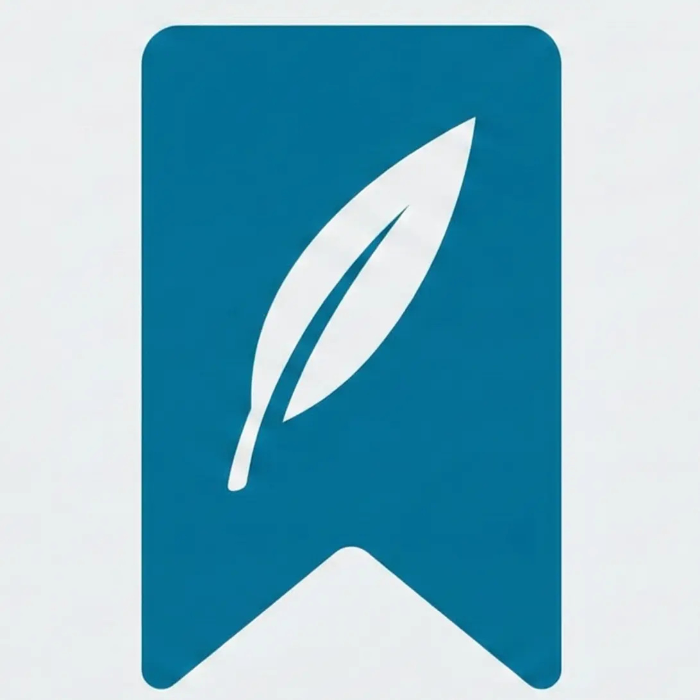

<div align="center">
  
  <h1>🍃 YewTab</h1>
  <p><strong>让浏览器收藏夹/书签在新标签页上清晰可见</strong></p>
</div>

<p align="center">
YewTab 是一个基于 React 和 Vite 构建的现代浏览器扩展（Manifest V3），为 Edge 和 Chrome 提供简洁直观的书签浏览与管理体验。专注于以卡片形式展示书签，提供类似手机主屏幕的直观交互体验。
</p>

## 预览


你也可以访问 [在线 Demo](https://yew-tab-preview.pages.dev/) 体验 UI 和交互效果。

> **注意**：在线 Demo 使用模拟数据，所有操作（如拖拽排序、编辑书签等）不会持久化保存，刷新页面后会恢复初始状态。如需完整功能，请安装浏览器扩展。

## ✨ 功能

- **自定义新标签页**: 替换默认的新标签页，提供更清爽的界面
- **书签管理**: 直接在新标签页浏览和简单管理你的书签
- **文件夹导航**: 支持文件夹多级嵌套展开、状态保持和面包屑导航
- **文件夹全屏**: 支持双击全屏打开文件夹，直观浏览书签
- **高级编辑**: 支持书签与文件夹的剪切、复制、粘贴操作
- **展开状态持久化**: 记忆布局习惯，下次打开时快速定位所需书签
- **拖拽排序**: Alt + E 打开整理模式，使用拖拽方式重新排列书签卡片
- **搜索功能**: Ctrl + K支持网络搜索及本地书签快捷搜索
- **数据管理**: 支持设置与书签数据的导入导出及扩展自定义设置重置
- **主题支持**: 明暗主题切换，支持自定义背景
- **离线降级**: 书签快照缓存，网络异常时仍可访问

> 为了安全性，文件夹删除功能是禁用的。书签删除功能需要确认

### 开发中
- 完善的错误处理机制
- 单元测试与集成测试
- 性能优化与代码重构
- 新功能：详见[TODO 列表](./TODO.md)
- 更多自定义选项

## 📖 开发与贡献

关于项目的详细技术栈、目录结构、环境搭建及开发规范，请参阅：

👉 **[贡献指南 (CONTRIBUTING.md)](./CONTRIBUTING.md)**

### 快速开始

```bash
# 1. 安装依赖
pnpm install

# 2. 开发模式（支持热重载）
pnpm dev

# 3. 构建项目
pnpm build

# 4. 在浏览器扩展管理页面加载 'dist' 目录
#    Edge: edge://extensions
#    Chrome: chrome://extensions
#    启用"开发人员模式"后点击"加载解压缩的扩展"
```

> #### ⚠️ 请注意数据安全
> 扩展会直接读取你的浏览器书签数据，并且你在该扩展中的更改会与你的书签数据**同步**，建议提前备份好自己的书签数据。
> 你可以在扩展加载后在扩展的设置页面中备份，也可以直接使用浏览器的原生收藏夹管理功能备份
> 
> 快速跳转：[Microsoft Edge 收藏夹管理](edge://favorites) 或者 [Google Chrome 书签管理](chrome://bookmarks)

### 技术栈

- **前端框架**: React 18 + TypeScript
- **构建工具**: Vite + @crxjs/vite-plugin
- **样式方案**: Tailwind CSS v4
- **状态管理**: React Hooks
- **拖拽交互**: @dnd-kit
- **动画库**: Framer Motion
- **扩展平台**: Chrome Extension Manifest V3

## 🐛 已知问题

- 少数动画异常
- 性能优化仍在进行中
- 缺少测试覆盖
- 文档可能不完全准确或过时

如果发现问题，欢迎提交 Issue 或 Pull Request。

## License
Apache 2.0
