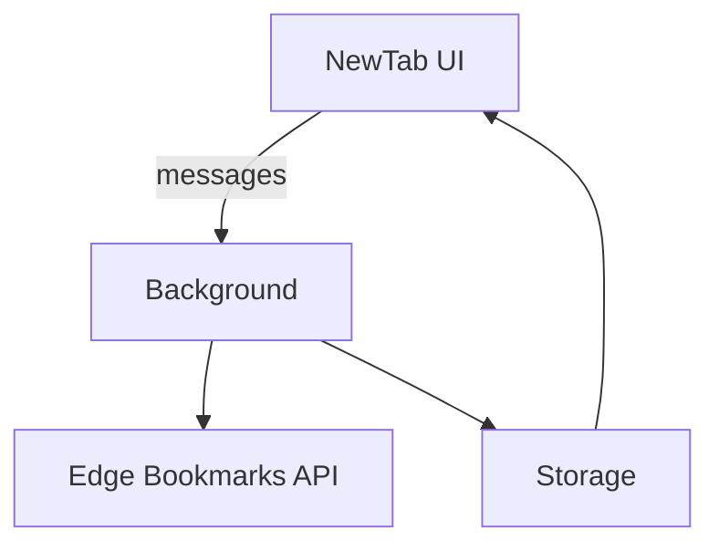

# 技术设计: Edge 新标签页书签面板

## 技术方案
### 核心技术
- Edge WebExtension (Manifest V3)
- chrome.bookmarks / chrome.storage.local
- React 18
- Vite
- webextension-polyfill
- Zustand（状态管理，可选）
- clsx（类名合并，可选）

### 实现要点
- 以 Edge 本地书签为唯一事实源，缓存仅用于离线展示
- Background 监听书签变化并广播给新标签页
- UI 操作通过消息请求写回书签 API
- 布局状态与书签快照分离存储

## 目录结构
```text
src/
  background/
    index.ts
  newtab/
    main.tsx
    app.tsx
    components/
  lib/
    bookmarks/
    storage/
    messaging/
  shared/
    types/
    constants/
public/
  manifest.json
```

## 必要配置文件
- package.json / pnpm-lock.yaml
- tsconfig.json
- tsconfig.node.json
- vite.config.ts
- .eslintrc.cjs（或 eslint.config.js）
- .prettierrc（可选）

## 架构设计


## 架构决策 ADR
### ADR-001: 本地书签为单一事实源
**上下文:** 新标签页需离线展示但仍保持与 Edge 收藏夹一致。
**决策:** 以 Edge 书签为事实源，离线时读取本地缓存。
**理由:** 避免双源冲突，保证一致性。
**替代方案:** 以本地缓存为主 → 拒绝原因: 易产生冲突与回写风险。
**影响:** 缓存仅用于加速与离线展示，不作为权威数据。

## API 设计
### MESSAGE load_bookmarks
- **请求:** { source: "ui" }
- **响应:** { tree, updatedAt }

### MESSAGE apply_bookmark_change
- **请求:** { action, payload }
- **响应:** { success, error }

## 数据模型
```json
{
  "bookmarks_snapshot": {
    "version": 1,
    "updated_at": "2026-01-05T09:25:00Z",
    "tree": {}
  },
  "layout_state": {
    "pinned_ids": [],
    "last_open_folder": null
  }
}
```

## 安全与性能
- **安全:** 最小权限原则，所有输入需过滤与转义
- **性能:** 书签树加载后按需渲染，避免一次性渲染过多节点

## 测试与部署
- **测试:** 手动验收清单覆盖首次加载、变更同步、离线展示
- **部署:** 通过 Edge 扩展开发者模式加载
