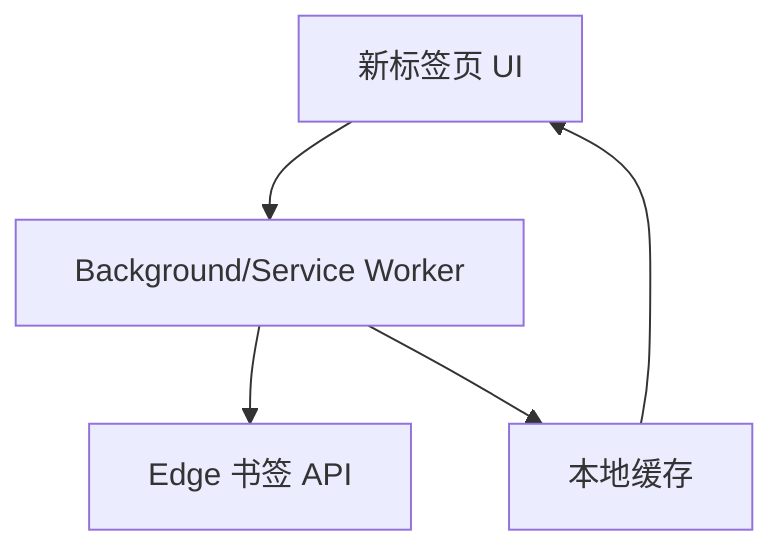
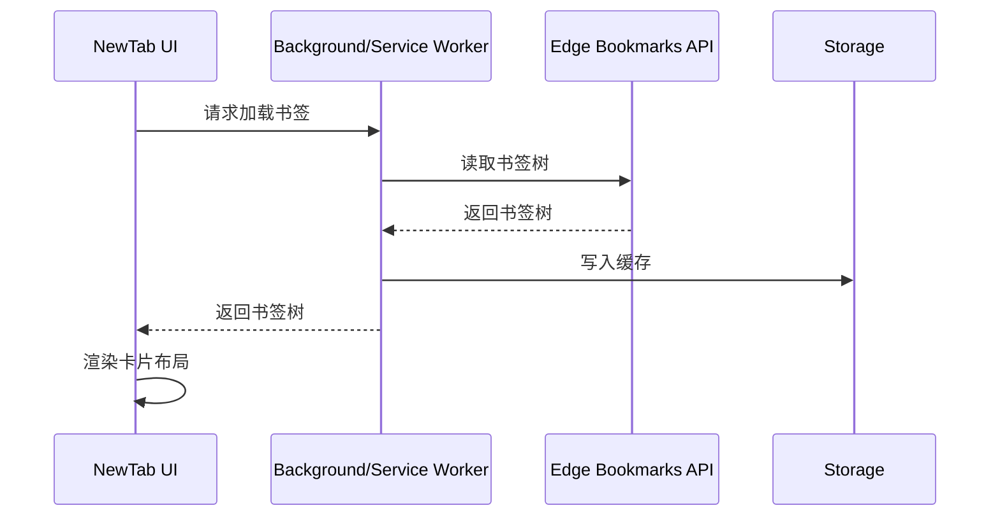

# 架构设计

## 总体架构


## 技术栈
- **前端:** React 18 + Vite
- **扩展:** Edge WebExtension (Manifest V3)
- **数据:** chrome.storage.local

## 核心流程


## 重大架构决策
完整的ADR存储在各变更的how.md中，本章节提供索引。

| adr_id | title | date | status | affected_modules | details |
|--------|-------|------|--------|------------------|---------|
| ADR-001 | 本地书签为单一事实源 | 2026-01-05 | ✅已采纳 | bookmark-sync, storage | [链接](../plan/202601051725_edge_newtab_bookmarks/how.md#adr-001-本地书签为单一事实源) |
```
